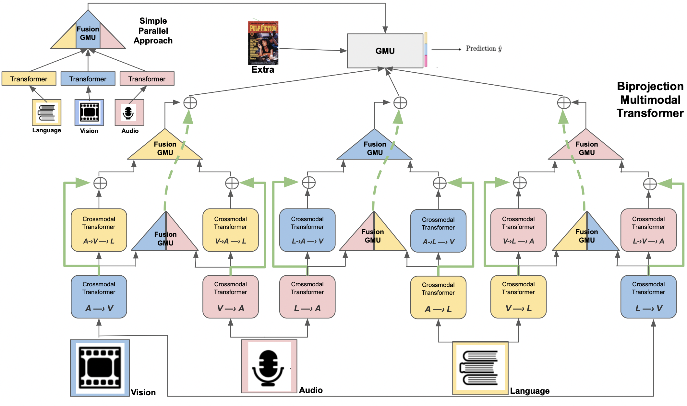

# MS Degree Thesis: Biprojection Multimodal Transformer (BPMulT) for Multimodal Data Classification

We propose a novel multimodal-transformer-based architecture (BPMulT), which is an improvement of MulT model using twice the Crossmodal Transformer (biprojection) and proposed dynamic fusion modules (Fusion-GMU) to combine the modalities' information.

## BPMulT architecture



## Tasks

***Movie genre classification (multimodal-4):*** Using the movie trailers where we obtain video frames, audio spectrograms, movie plot as text, and movie poster (image) from the [Moviescope](https://www.cs.virginia.edu/~pc9za/research/moviescope.html) dataset. 

***Movie genre classification (bimodal):*** Using the movie plot as text and movie poster (image) from the [MM-IMDb](https://github.com/johnarevalo/gmu-mmimdb) dataset. 

***Emotion detection (multimodal-3)*** Using the Aligned  (20) and Unaligned version of  [IEMOCAP](http://immortal.multicomp.cs.cmu.edu/raw_datasets/processed_data/) dataset, which contains monologues performed by actors and it gives facial features (vision), transcript (text), and voice features (audio).

***Emotion detection (multimodal-3)*** Using the Unaligned polished version of  [CMU-MOSEI](http://immortal.multicomp.cs.cmu.edu/raw_datasets/processed_data/) dataset, given by the paper [Multimodal-End2end-Sparse](https://github.com/wenliangdai/Multimodal-End2end-Sparse) (*iemocap_data_noalign.pkl*). Contains monologues from YouTube about random topics. It gives video preprocessed features, transcription, and voice features.

## Publications

This repo contains the code used for the preprint version of a publication in submission to Elsevier Information Fusion [Biprojection Multimodal Transformer (BPMulT) for Multimodal Data Classification](https://github.com/Damorgal/BS-Thesis-Statistical-Analysis-Agavin-prebiotics/blob/main/BS_Thesis_DiegoAMG.pdf)

The paper above is a polished version of my MS degree [Thesis](https://github.com/Damorgal/BS-Thesis-Statistical-Analysis-Agavin-prebiotics/blob/main/BS_Thesis_DiegoAMG.pdf). If you want to see more details about our research, we recommend to see the thesis doc. 

## Usage

Command example to run the training script on Moviescope:

```
>> python3 bpmult/train.py --from_seed 1  --model mmtrvapt --batch_sz 8 --gradient_accumulation_steps 8 --savedir /home/User/BPMulT_moviescope_examplePath --data_path /home/User/datasets --task moviescope --visual both --task_type multilabel --num_image_embeds 3 --lr_patience 2 --patience 6 --dropout 0.1 --lr 5e-5 --warmup 0.1 --max_epochs 100  --num_heads 6 --layers 5 --orig_d_v 4096 --hidden_sz 768 
```

Command example to run the training script on MM-IMDb:

```
>> python3 mmbt/train.py --from_seed 1  --model mmtrvapt --batch_sz 6 --gradient_accumulation_steps 6 --savedir /home/User/BPMulT_mmimdb_examplePath --data_path /home/User/datasets --task mmimdb --visual both --task_type multilabel --num_image_embeds 3 --lr_patience 2 --patience 6 --dropout 0.1 --lr 5e-5 --warmup 0.1 --max_epochs 100  --num_heads 6 --orig_d_v 300 --orig_d_a 1

```

Command example to run the training script on CMU-MOSEI:

```
>> python3 mmbt/train.py --from_seed 1  --model mmtrvat --batch_sz 8 --gradient_accumulation_steps 8 --savedir /home/User/BPMulT_cmu-mosei_examplePath --data_path /home/User/datasets --task cmu-mosei --visual both --task_type multilabel --num_image_embeds 3 --lr_patience 2 --patience 5 --dropout 0.1 --lr 5e-5 --warmup 0.1 --max_epochs 100  --num_heads 12 --nlevels 8 --layers 8 --orig_d_v 35 --orig_d_a 74 --hidden_sz 300
```

Command example to run the training script on IEMOCAP:

```
>> python3 mmbt/train.py --from_seed 1  --model mmtrvat --batch_sz 8 --gradient_accumulation_steps 8 --savedir /home/User/BPMulT_iemocap_examplePath --data_path /home/User/datasets --task iemocap --visual both --task_type multilabel --num_image_embeds 3 --lr_patience 2 --patience 5 --dropout 0.1 --lr 5e-5 --warmup 0.1 --max_epochs 100  --num_heads 12 --nlevels 8 --layers 8 --orig_d_v 35 --orig_d_a 74 --hidden_sz 300
```

## Related works:

* [MulT-GMU](https://aclanthology.org/2021.maiworkshop-1.1.pdf): Multimodal Weighted Fusion of Transformers for Movie Genre Classification.

* [Mult End2end](https://arxiv.org/pdf/2103.09666.pdf): Multimodal End-to-End Sparse Model for Emotion Recognition.

* [Mod-Trans](https://arxiv.org/pdf/2009.09629.pdf): Modality-Transferable Emotion Embeddings for Low-Resource Multimodal Emotion Recognition.

* [MulT](https://www.aclweb.org/anthology/P19-1656.pdf): Multimodal Transformer for Unaligned Multimodal Language Sequences.
* [MMBT](https://arxiv.org/abs/1909.02950): "Supervised Multimodal Bitransformers for Classifying Images and Text.
* [Moviescope Dataset](https://arxiv.org/abs/1908.03180): Moviescope: Large-scale Analysis of Movies using Multiple Modalities.
* [GMU and MM-IMDb](https://arxiv.org/abs/1702.01992): Gated Multimodal Units for Information Fusion.

## Versions

* python 3.7.6
* torch 1.5.1
* tokenizers 0.9.4
* transformers 4.2.2
* Pillow 7.0.0
